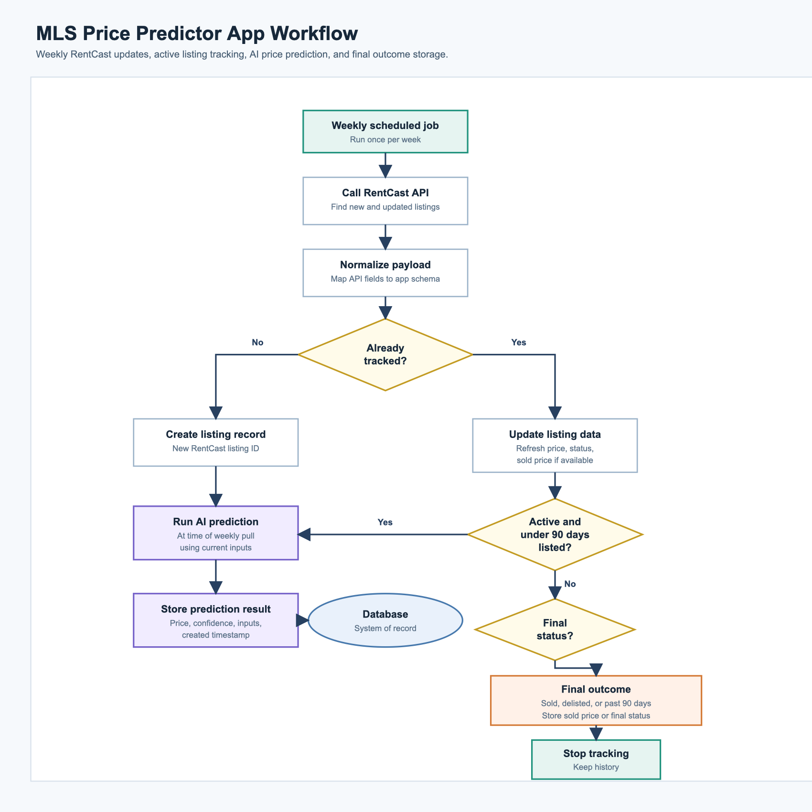

# MLS Price Predictor

A full-stack web application that predicts MLS property prices using a rule-based system that factors in interest rates, comparable listings, market trends, and other real estate metrics.

## 🚀 Features

- **Real-time MLS Data**: Integrates with RentCast API to fetch 100+ listings per week
- **Intelligent Price Prediction**: Rule-based prediction engine that considers:
  - Current interest rates
  - Comparable listings (comps) with geospatial queries
  - Days on market
  - Market trends
  - Seasonal adjustments
- **Interactive Map**: MapLibre-based visualization with listing markers and popups
- **Advanced Search**: Filter by location, price, beds, baths, property type
- **Price Comparisons**: See predicted vs. list price with confidence scores
- **Interest Rate Simulator**: Adjust interest rates to see impact on predicted prices

## App Workflow

See [docs/app-workflow.md](docs/app-workflow.md) for the listing lifecycle and prediction workflow.



## 🛠 Tech Stack

### Backend
- **Runtime**: Node.js with TypeScript
- **Framework**: Express.js
- **Database**: PostgreSQL with PostGIS (geospatial queries)
- **API Integration**: RentCast API
- **Scheduling**: node-cron for weekly data syncs
- **Logging**: Winston

### Frontend
- **Framework**: React 18 with TypeScript
- **Build Tool**: Vite
- **Maps**: MapLibre GL JS + OpenFreeMap
- **Styling**: CSS 3 with CSS Variables
- **Icons**: Lucide React
- **Routing**: React Router v6

### Infrastructure
- **Containerization**: Docker & Docker Compose
- **Cloud**: AWS (S3, EC2, CodeDeploy)
- **Maps**: OpenFreeMap + MapLibre

## 📋 Prerequisites

- Node.js 18+ and npm/yarn
- Docker & Docker Compose (for containerized setup)
- PostgreSQL 15+ with PostGIS extension (or use provided Docker setup)
- RentCast API key (get from [rentcast.io](https://rentcast.io))
- AWS credentials (for deployment)

## 🚀 Quick Start

### Option 1: Docker Compose (Recommended)

```bash
# Clone and setup
cd /Users/mattheard/Code/mls-price-predictor

# Create .env file
cp backend/.env.example backend/.env

# Edit backend/.env with your credentials
nano backend/.env
# Set: RENTCAST_API_KEY, AWS_REGION, AWS_ACCESS_KEY_ID, AWS_SECRET_ACCESS_KEY

# Start services
docker-compose up -d

# Run migrations (in another terminal)
docker-compose exec backend npm run migrate

# Access
# Frontend: http://localhost:3000
# Backend: http://localhost:3001
# Database: localhost:5432
```

### Option 2: Manual Setup

#### Backend Setup
```bash
cd backend

# Install dependencies
npm install

# Create .env file
cp .env.example .env

# Update .env with your configuration
nano .env

# Setup PostgreSQL with PostGIS
# psql -U postgres -d postgres -f ../database/init.sql

# Run migrations
npm run migrate

# Start development server
npm run dev
```

#### Frontend Setup
```bash
cd frontend

# Install dependencies
npm install

# Start dev server
npm run dev
```

## 📁 Project Structure

```
mls-price-predictor/
├── backend/
│   ├── src/
│   │   ├── index.ts                 # Entry point
│   │   ├── routes/
│   │   │   ├── listings.ts          # Listings endpoints
│   │   │   └── predictions.ts       # Prediction endpoints
│   │   ├── services/
│   │   │   ├── rentcastService.ts   # RentCast API integration
│   │   │   ├── predictionEngine.ts  # Price prediction logic
│   │   │   └── scheduler.ts         # Weekly sync jobs
│   │   ├── models/
│   │   │   ├── Listing.ts           # Listing schema
│   │   │   └── Prediction.ts        # Prediction schema
│   │   └── utils/
│   │       ├── database.ts          # DB connection
│   │       ├── logger.ts            # Logging setup
│   │       └── errorHandler.ts      # Error handling
│   ├── migrations/
│   │   └── 001_init.sql             # Database schema
│   ├── package.json
│   ├── tsconfig.json
│   ├── Dockerfile
│   └── .env.example
│
├── frontend/
│   ├── src/
│   │   ├── main.tsx                 # React entry point
│   │   ├── App.tsx                  # App layout
│   │   ├── components/
│   │   │   ├── Map.tsx              # MapLibre component
│   │   │   └── SearchFilters.tsx    # Search/filter UI
│   │   ├── pages/
│   │   │   ├── Dashboard.tsx        # Main dashboard
│   │   │   └── Listings.tsx         # Listings grid
│   │   ├── services/
│   │   │   └── api.ts               # API client
│   │   ├── styles/
│   │   │   ├── App.css
│   │   │   ├── Dashboard.css
│   │   │   ├── Listings.css
│   │   │   ├── Map.css
│   │   │   └── SearchFilters.css
│   │   └── index.css
│   ├── index.html
│   ├── package.json
│   ├── tsconfig.json
│   ├── vite.config.ts
│   ├── Dockerfile
│   └── .env.example
│
├── docker-compose.yml
├── .gitignore
├── README.md
├── SETUP.md
└── LICENSE
```

## 🔌 API Endpoints

### Listings
- `GET /api/listings` - Get listings with filters
- `GET /api/listings/:id` - Get single listing details

### Predictions
- `GET /api/predictions/listing/:id` - Get prediction for a listing
- `POST /api/predictions/batch` - Get predictions for multiple listings

### Health
- `GET /health` - Server health check

## 📊 Database Schema

### listings
- `id`, `rentcast_id`, `address`, `city`, `state`, `zip_code`
- `latitude`, `longitude` (with spatial index)
- `list_price`, `beds`, `baths`, `sqft`
- `property_type`, `year_built`, `listing_status`

### predictions
- `id`, `listing_id`, `predicted_price`, `confidence`
- `factors` (JSONB), `interest_rate`

### comps
- Comparable listings linked to predictions

## 🎯 Prediction Engine

The rule-based system considers:
- Comparable listings within 10 miles
- Interest rate impact (6.5% base rate)
- Days on market discounts
- Market trends and seasonal factors
- Confidence score (up to 95%)

## 🔄 Data Sync

- **Weekly**: Fetch 100 listings from RentCast (Monday 2 AM UTC)
- **Daily**: Calculate predictions for new listings (3 AM UTC)

## 🚀 Deployment

### Quick Start with Docker

```bash
docker-compose up -d
docker-compose exec backend npm run migrate
```

### AWS Deployment

1. Build Docker images
2. Push to AWS ECR
3. Create RDS PostgreSQL instance with PostGIS
4. Deploy via ECS or EC2

## 🔐 Environment Setup

See [SETUP.md](SETUP.md) for detailed configuration instructions.

## 📝 Development

```bash
# Backend
cd backend && npm install && npm run dev

# Frontend
cd frontend && npm install && npm run dev
```

## 📞 Support

See [SETUP.md](SETUP.md) for troubleshooting and detailed setup instructions.

---

**Version**: 1.0.0 | **Updated**: 2026-07-02
