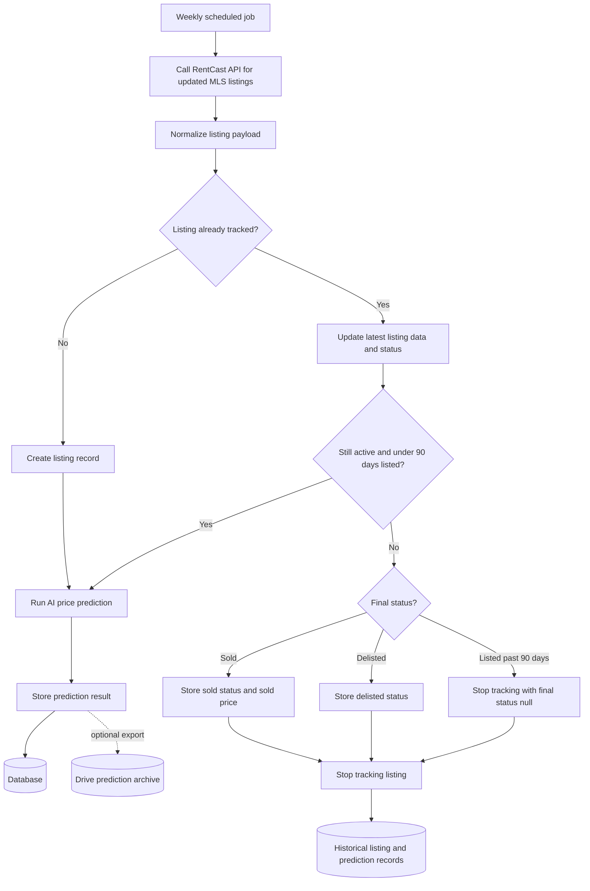

# MLS Price Predictor App Workflow

## Listing Lifecycle Workflow

## Data Stored Per Listing

Each tracked listing should keep the core listing snapshot and final outcome:

| Field | Purpose |
| --- | --- |
| `listing_id` | RentCast or MLS listing identifier |
| `sq_ft` | Interior square footage |
| `lot_sq_ft` | Lot size in square feet |
| `list_price` | Current or initial list price |
| `date_listed` | Date the listing first appeared |
| `final_list_status` | `sold`, `delisted`, or `null` when past 90 days listed |
| `sold_at_price` | Final sold price when available |

## Prediction Storage

At each weekly pull, the app should run an AI price prediction for active listings and store:

| Field | Purpose |
| --- | --- |
| `listing_id` | Links prediction to the listing |
| `predicted_price` | AI-generated price estimate |
| `prediction_confidence` | Optional model confidence or score |
| `prediction_inputs` | Snapshot of inputs used by the model |
| `created_at` | Time prediction was generated |

Predictions should be stored in the database for querying inside the app. A Drive export can be added as an archive or reporting layer, but the database should remain the system of record.

## Tracking Rules

- Poll RentCast once per week for new and updated listings.
- Track each listing until one of these happens:
  - RentCast reports it as `sold`.
  - RentCast reports it as `delisted`.
  - The listing has been active for more than 90 days.
- For listings past 90 days without a sold or delisted status, stop tracking and leave `final_list_status` as `null`.
- Keep historical predictions even after tracking stops, so prediction quality can be evaluated later against final outcomes.
